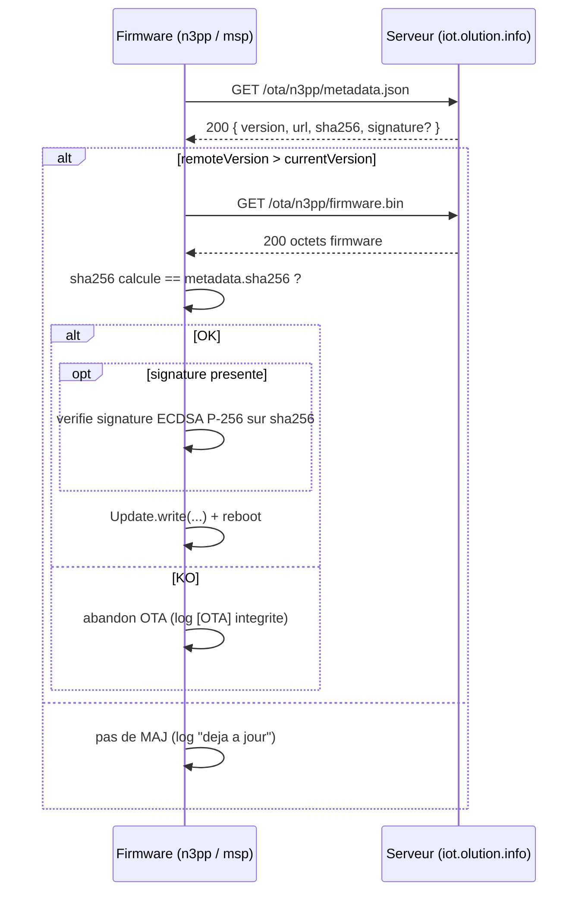

# OTA — firmwares n3pp et msp

Documentation du contrat OTA entre les firmwares legacy **n3pp** (serre/aquaponie, board=3) et **msp** (station météo, board=2) et le serveur unifié (`iot.olution.info`).

> Pour le contrat OTA **FFP5CS** (canaux, MD5 binaire, JSON multi-cible), voir [`firmwires/ffp5cs/docs/technical/OTA_PUBLISH.md`](../../firmwires/ffp5cs/docs/technical/OTA_PUBLISH.md).

---

## 1. Vue d'ensemble



Périodicité côté firmware : **toutes les 2 h** cumulées (compteur RTC, additionne le temps de deep sleep). Vérification supplémentaire au front montant du reset distant (GPIO 110).

---

## 2. URLs

| Cible | Build | URL metadata | URL firmware.bin |
|-------|-------|--------------|------------------|
| n3pp prod | `pio run -e esp32dev` | `http://iot.olution.info/ota/n3pp/metadata.json` | `http://iot.olution.info/ota/n3pp/firmware.bin` |
| n3pp test | `pio run -e esp32dev_test` (`-DTEST_MODE`) | `http://iot.olution.info/ota/n3pp-test/metadata.json` | `http://iot.olution.info/ota/n3pp-test/firmware.bin` |
| msp prod | `pio run -e esp32dev` | `http://iot.olution.info/ota/msp/metadata.json` | `http://iot.olution.info/ota/msp/firmware.bin` |
| msp test | `pio run -e esp32dev_test` (`-DTEST_MODE`) | `http://iot.olution.info/ota/msp-test/metadata.json` | `http://iot.olution.info/ota/msp-test/firmware.bin` |

Côté serveur, ces routes sont servies par le handler statique `$otaHandler` dans [`serveur/public/index.php`](../public/index.php) (~l.230).

---

## 3. Format du `metadata.json`

Format **simple** (n3pp, msp) — un seul firmware par fichier :

```json
{
  "version": "4.38",
  "min_version": "4.38",
  "url": "http://iot.olution.info/ota/n3pp/firmware.bin",
  "sha256": "9e3a...c0",
  "signature": "MEUCIQDx...=="
}
```

| Champ | Type | Obligatoire | Description |
|-------|------|-------------|-------------|
| `version` | string | oui | Version distante (ex. `"4.38"`). Comparée à `FIRMWARE_VERSION` du firmware via `compareVersions()` (`maj.min.patch`). |
| `min_version` | string | non | Renseigné par `publish_ota.ps1` mais non lu par `n3_ota.cpp` (réservé). |
| `url` | string | oui | URL du `firmware.bin` à télécharger. Doit pointer vers le même serveur. |
| `sha256` | string (hex 64) | **oui** | SHA-256 hex du binaire ; **vérifié** par `n3_ota.cpp` avant le flash (depuis v1.3.0 de `n3_common`). |
| `signature` | string (base64) | non | Signature ECDSA P-256 du `sha256` (clé publique embarquée dans `n3_ota_pubkey.h`). Si présente, **vérifiée** par le firmware. |

> Le contrat **FFP5CS** utilise un format multi-cible (`channels.prod`, `channels.beta`, etc.) avec `bin_url`, `md5`, `size`. Les firmwares n3pp/msp utilisent le format **simple** ci-dessus.

---

## 4. Vérification d'intégrité côté firmware

Code de référence : [`firmwires/shared/n3_common/src/n3_ota.cpp`](../../firmwires/shared/n3_common/src/n3_ota.cpp).

Flux :

1. `n3OtaCheck()` télécharge `metadata.json` (timeout 10 s — toléré pour OTA, dérogation à la règle 5 s).
2. Parse `version`, `url`, `sha256`, `signature`.
3. Si `remoteVersion > currentVersion` :
   1. Appelle `verifyRemoteFirmwareIntegrity()` qui télécharge le `firmware.bin` en streaming et calcule le SHA-256 via `mbedtls_md`.
   2. Compare avec `metadata.sha256` (insensitive case). Si mismatch : abandon avec log `[OTA] Echec verification integrite`.
   3. Si `signature` est présente : `mbedtls_pk_verify()` ECDSA sur la clé publique embarquée. Si invalide : abandon.
   4. Si OK : `httpUpdate.update()` télécharge et écrit la nouvelle partition, puis reboot.

Échec d'intégrité = **rollback automatique** côté ESP-IDF (la partition de boot n'est pas modifiée).

---

## 5. Publication d'une nouvelle version

Script : [`scripts/publish_ota.ps1`](../../scripts/publish_ota.ps1).

Exemples :

```powershell
# Build + publication n3pp (production)
.\scripts\publish_ota.ps1 -Target n3pp -Sign

# Build + publication msp (variante test)
.\scripts\publish_ota.ps1 -Target msp-test -Sign

# Publication multiple
.\scripts\publish_ota.ps1 -Targets n3pp,msp -Sign
```

Le script :

1. Lance `pio run -e esp32dev` (ou `-e esp32dev_test`) depuis `firmwires/n3pp/` ou `firmwires/msp/`.
2. Récupère `firmware.bin` (cf. `firmwires/scripts/Get-PioBuildHelpers.ps1` qui supporte la redirection `C:\pio-builds`).
3. Calcule le `sha256` hex via `Get-FileHash`.
4. Signe le hash avec `scripts/ota_keys/private_key.pem` (option `-Sign`) — la clé publique correspondante est dans [`firmwires/shared/n3_common/src/n3_ota_pubkey.h`](../../firmwires/shared/n3_common/src/n3_ota_pubkey.h).
5. Copie `firmware.bin` vers `serveur/ota/<target>/firmware.bin` et écrit le `serveur/ota/<target>/metadata.json`.
6. Git commit + push (déclenche le cron déploiement, voir [`.cursor/rules/git-et-versionnement.mdc`](../../.cursor/rules/git-et-versionnement.mdc)).

---

## 6. Sécurité

| Aspect | Statut n3pp/msp | Recommandation |
|--------|-----------------|----------------|
| Transport | **HTTP** (legacy) | Migration HTTPS prévue Phase 4. Risque MITM acceptable tant que la **vérification SHA-256 + signature ECDSA** est active côté firmware. |
| Intégrité SHA-256 | **OUI** (`n3_ota.cpp` depuis n3_common 1.3+) | Conserver ; documenter dans `VERSION.md` quand le `sha256` est présent. |
| Authenticité ECDSA | **Optionnelle** (champ `signature` si `-Sign`) | Rendre obligatoire en prod ; refuser metadata sans signature. |
| Auth route `/ota/...` | **Aucune** | Acceptable car l'intégrité+signature protège le firmware ; sinon ajouter `X-Api-Key`. |
| Rollback | Auto (ESP-IDF partition slot) | Le hook `firmwires/n3pp/scripts/upload_hook_otadata.py` réaligne la partition `app0` après flash USB. |

---

## 7. Tests recommandés

1. **Smoke OTA test** (sans signature) : déployer une version `9.99-test` sur `n3pp-test`, vérifier le log `[OTA] sha256 metadata=... sha256 calcule =...` puis le reboot.
2. **SHA-256 mismatch** : modifier manuellement le `metadata.json` (faux hash) → le firmware doit logger `[OTA] Echec verification integrite: SHA256 OTA mismatch (metadata != calcule).` et **ne pas** flasher.
3. **Signature invalide** : signer avec une clé différente → log `[OTA] Echec verification integrite: Signature OTA invalide`.
4. **Pas de WiFi** : couper le WiFi → log `[OTA] Pas de WiFi, verification ignoree` ; le firmware ne doit pas redémarrer.

---

## 8. Versions concernées

| Composant | Version | Notes |
|-----------|---------|-------|
| `firmwires/shared/n3_common` | ≥ 1.3.0 | Vérification SHA-256 + ECDSA active dans `n3_ota.cpp`. |
| `firmwires/n3pp` | ≥ 4.36 | Affichage progression OTA OLED ; ≥ 4.38 = phase 1 audit. |
| `firmwires/msp` | ≥ 2.38 | Affichage progression OTA OLED ; ≥ 2.42 = phase 1 audit. |
| `scripts/publish_ota.ps1` | inchangé | Génère sha256+signature pour `-Target n3pp|msp`. |

---

## 9. Références croisées

- Contrat de version : [`.cursor/rules/git-et-versionnement.mdc`](../../.cursor/rules/git-et-versionnement.mdc) (incrémenter `FIRMWARE_VERSION` + `VERSION.md` à chaque release OTA).
- Cohérence firmware↔serveur : [`.cursor/rules/coherence-firmware-serveur.mdc`](../../.cursor/rules/coherence-firmware-serveur.mdc).
- Sécurité secrets : [`.cursor/rules/securite-et-secrets.mdc`](../../.cursor/rules/securite-et-secrets.mdc).
- OTA FFP5CS détaillé : [`firmwires/ffp5cs/docs/technical/OTA_PUBLISH.md`](../../firmwires/ffp5cs/docs/technical/OTA_PUBLISH.md).
